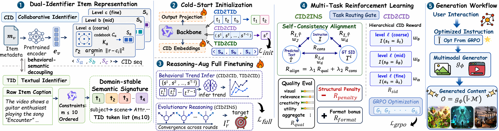

<div align="center">

# 🧭 NaviGen

### Personalized AIGC Generation with Dual Item Identifiers and Alignment Rewards ✨

<p>
  <a href="https://github.com/iLearn-Lab/NaviGen">
    
  </a>
  
  
  
  <a href='https://arxiv.org/pdf/2606.24196'></a>
</p>
<div align="center">
  
  <p><em>NaviGen connects dual-identifier construction, staged SFT, GRPO alignment, constrained personalized inference, and image/video generation.</em></p>
</div>
<p>
  <a href="https://huggingface.co/PillowTa1k/NaviGen">🤗 Model Checkpoints: PillowTa1k/NaviGen</a>
</p>

<p>
  <a href="#concepts">🧭 Concepts</a> |
  <a href="#framework">🏗️ Framework</a> |
  <a href="#installation">⚙️ Installation</a> |
  <a href="#preprocessing">🧪 Preprocessing</a> |
  <a href="#training">🔥 Training</a> |
  <a href="#inference">🚀 Inference</a> |
  <a href="#generation">🎬 Generation</a>
</p>

<p>
NaviGen is a personalized AIGC generation framework built around dual item identifiers.
It couples behavioral collaborative codes with semantic textual codes, then trains a Qwen3-based policy to recommend the next item and write visually generatable image or video instructions.
</p>

</div>

---

### 🚨 Current Personalized AIGC Challenges

- ❌ **Behavior-semantic gap** - Recommendation signals capture user preference, while generation prompts need semantic and visual details.
- ❌ **Generic instructions** - AIGC prompts may be fluent but underspecified, weakly personalized, or hard for image/video models to realize.
- ❌ **Misaligned optimization** - Next-item prediction, TID prediction, instruction quality, and visual generatability are often optimized separately.

### 💡 NaviGen Solution

🧭 **NaviGen** treats personalized generation as a unified recommendation-to-instruction workflow. It represents each item with a collaborative identifier and a textual identifier, distills reasoning through staged SFT, and uses GRPO rewards to align recommendation accuracy, structured output, semantic consistency, and AIGC instruction quality.

---

<a id="news"></a>

## 📢 News

- Codebase organized around preprocessing, staged SFT, GRPO training, constrained inference, and image/video generation.
- Released GRPO step-600 checkpoints are hosted on Hugging Face: [PillowTa1k/NaviGen](https://huggingface.co/PillowTa1k/NaviGen).
- The repository no longer stores released model checkpoint folders; download the checkpoints from Hugging Face and pass the local path to inference scripts.

---

<a id="concepts"></a>

## 🧭 Concepts

- `CID`: Collaborative code, a tokenized behavioral identifier such as `<|cid_begin|><s_a_3855><s_b_7257><s_c_3681><|cid_end|>`.
- `TID`: Textual code, a compact list of English semantic terms for an item.
- `Dual identifier`: the coupled CID + TID representation used by NaviGen.
- `cid2cid`: recommend the next CID from user history.
- `cid2ins`: predict target TID and generate a personalized AIGC instruction.

---

<a id="repository-structure"></a>

## 📂 Repository Structure

```text
NaviGen/
  assets/                     # Framework figure and project assets
  dataset/                    # Parquet splits for cid2tid, tid2cid, cid2cid, cid2ins, and catalog mapping
  preprocess/                 # TID generation, identifier reasoning, prompt search, CID vocab expansion
  train/                      # Stage-1 SFT, Stage-2 SFT, and GRPO training
  infer/                      # Constrained cid2cid and cid2ins inference
  generation/                 # Z-Image image generation and OpenSora video generation
  project_env.py              # Lightweight .env loader used by repository scripts
  requirements.txt            # Python dependencies
```

---

<a id="installation"></a>

## ⚙️ Installation

We recommend using `conda` to create a reproducible Python environment.

```bash
conda create -n navigen python=3.10 -y
conda activate navigen
pip install -r requirements.txt
```

For CUDA training machines, install PyTorch, Unsloth, and vLLM builds that match your driver and CUDA version. Image generation expects a local Z-Image model directory, while video generation requires an OpenSora environment and local OpenSora checkpoints.

Main dependencies include `torch`, `transformers`, `datasets`, `accelerate`, `peft`, `trl`, `unsloth`, `pyarrow`, `lm-format-enforcer`, `dashscope`, `diffusers`, `torchao`, and optional environment-specific packages such as `deepspeed`, `flash-attn`, and `bitsandbytes`.

---

<a id="configuration"></a>

## 🔐 Configuration

Repository scripts load `.env` automatically through `project_env.py`. Keep real API keys and machine-specific paths local.

```bash
DASHSCOPE_API_KEY=""
DASHSCOPE_API_KEYS=""
NAVIGEN_TEACHER_MODEL="qwen3.5-flash"
NAVIGEN_QWEN3_BASE_MODEL="./Qwen3-1.7B"
NAVIGEN_CID_MODEL_DIR="./Qwen3-1.7B-cid-expanded-clean"
NAVIGEN_SFT_INPUT_DIR="./dataset"
NAVIGEN_INFER_INPUT_DIR="./dataset"
NAVIGEN_PID2CID2TID_PATH="./dataset/pid2cid2tid.parquet"
NAVIGEN_ZIMAGE_PATH="./Z-Image-Turbo"
```

---

<a id="data"></a>

## 📦 Data

Bundled parquet data lives under `dataset/`:

```text
train_cid2tid.parquet
valid_cid2tid.parquet
test_cid2tid.parquet
train_tid2cid.parquet
valid_tid2cid.parquet
test_tid2cid.parquet
train_cid2cid.parquet
valid_cid2cid.parquet
test_cid2cid.parquet
train_cid2ins.parquet
valid_cid2ins.parquet
test_cid2ins.parquet
pid2cid2tid.parquet
```

Compatibility mapping:

| Task | Input columns | Target columns |
| --- | --- | --- |
| `cid2tid` | `sid` | `tid` / `target_tid` |
| `tid2cid` | `tid` | `sid` |
| `cid2cid` | `hist_sid` | `target_sid` |
| `cid2ins` | `hist_sid` | `target_tid`, `target_ins` |

---

<a id="preprocessing"></a>

## 🧪 Preprocessing

Generate TIDs from item captions:

```bash
python preprocess/step0_generate_tid_from_caption.py \
  --input products_user_pid2caption.json \
  --output products_user_pid2tid.json \
  --resume
```

Run identifier reasoning and prompt distillation when rebuilding supervision:

```bash
python preprocess/step1_generate_identifier_think.py --resume
python preprocess/step2_evolutionary_prompt_search.py --resume
python preprocess/step3_distill_oneshot_prompt_think.py --resume
```

Expand the Qwen3 tokenizer/model with CID tokens:

```bash
python preprocess/expand_qwen3_cid_vocab.py \
  --model_name_or_path ./Qwen3-1.7B \
  --parquet_path dataset/pid2cid2tid.parquet \
  --output_dir ./Qwen3-1.7B-cid-expanded-clean \
  --trust_remote_code
```

---

<a id="training"></a>

## 🔥 Training

### 🧠 Stage-1 SFT

Stage-1 aligns the expanded model with CID/TID conversion and identifier reasoning tasks.

```bash
python train/sft_aigc_stage1_embed.py
```

### 🎯 Stage-2 SFT

Stage-2 trains the full personalized recommendation and AIGC instruction generation behavior.

```bash
python train/sft_aigc_stage2_full_ft.py
```

### 🚀 GRPO Optimization

GRPO jointly optimizes `cid2cid` recommendation and `cid2ins` instruction generation. By default, the script launches torchrun and uses a vLLM rollout endpoint.

```bash
python train/rl_grpo_rec_aigc_constrained.py \
  --nproc_per_node 4 \
  --base_model_dir /path/to/stage2/final \
  --train_cid2cid_path dataset/train_cid2cid.parquet \
  --train_cid2ins_path dataset/train_cid2ins.parquet \
  --val_cid2cid_path dataset/valid_cid2cid.parquet \
  --val_cid2ins_path dataset/valid_cid2ins.parquet \
  --judge_api_key YOUR_DASHSCOPE_KEY \
  --output_dir rl_output/grpo_run
```

The GRPO reward combines:

```text
R = R_cid2cid + R_cid2ins + R_format + R_think
```

- `R_cid2cid`: CID matching reward with `s_a`, `s_b`, and `s_c` component weights.
- `R_cid2ins`: semantic and instruction-quality reward for target TID and generated AIGC instruction.
- `R_format`: JSON serialization and schema reward.
- `R_think`: reasoning-format gate for valid thinking traces.

The GRPO trainer saves the final adapter under `rl_output/grpo_run/final_rl_lora` unless `--output_dir` is changed.

---

<a id="inference"></a>

## 🚀 Inference

Download the released checkpoint from [PillowTa1k/NaviGen](https://huggingface.co/PillowTa1k/NaviGen), then pass its local directory to `--model_dir`.

Run constrained next-CID recommendation:

```bash
python infer/infer_sft_aigc_stage2_cid2cid_constrained.py \
  --model_dir /path/to/downloaded/checkpoint \
  --input_dir dataset \
  --num_candidates 40 \
  --generation_mode direct_json_prefix
```

Run personalized TID and instruction generation:

```bash
python infer/infer_sft_aigc_stage2_cid2ins.py \
  --model_dir /path/to/downloaded/checkpoint \
  --input_dir dataset \
  --generation_mode two_stage \
  --max_rows 10
```

For full evaluation, remove `--max_rows` or set it to a larger value. The inference scripts write JSONL predictions and metrics to their configured `pred_dir`.

---

<a id="generation"></a>

## 🎬 Generation

Generate images with Z-Image from normalized prediction outputs:

```bash
python generation/gen_image_zimage.py \
  --baseline oracle \
  --height 512 \
  --width 512
```

Generate videos with OpenSora from prediction JSON/JSONL:

```bash
python generation/video_gen_opensora.py \
  --input-json outputs.jsonl \
  --prompt-field prediction.target_ins \
  --num-gpus 3
```

The complete generation flow is:

```text
user history
  -> cid2cid recommendation
  -> cid2ins target TID and instruction
  -> normalized AIGC prompt
  -> image or video synthesis
  -> personalized generated content
```

---

<a id="checkpoints"></a>

## 📦 Checkpoints

Model weights are hosted on Hugging Face instead of stored in this repository:

- [PillowTa1k/NaviGen](https://huggingface.co/PillowTa1k/NaviGen)

The release includes the GRPO step-600 checkpoint. Download the assets you need and pass their local paths to the corresponding inference or reproduction scripts.

---

<a id="output-schema"></a>

## 🧾 Output Schema

`cid2cid` inference produces the next collaborative identifier:

```json
{
  "target_cid": "<|cid_begin|><s_a_3855><s_b_7257><s_c_3681><|cid_end|>"
}
```

`cid2ins` inference predicts semantic terms and an AIGC-ready instruction:

```json
{
  "target_tid": ["dress", "summer", "floral"],
  "target_ins": "Generate a bright summer product image featuring a floral dress on a clean studio background."
}
```

---

<div align="center">

🌟 If this project helps your research, please consider giving NaviGen a Star!

<em>Thanks for visiting NaviGen ✨</em>

</div>
